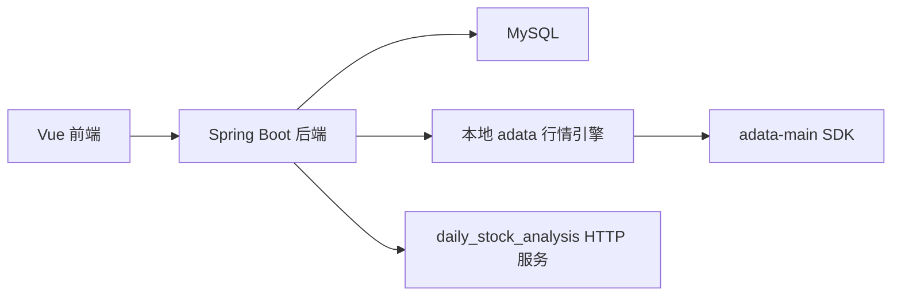
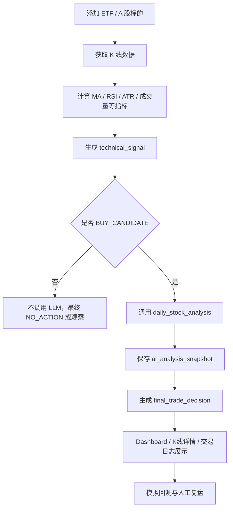

# Personal Kline Assistant 项目上下文与流程设计文档

更新时间：2026-05-29

本文档用于整理当前项目从第一阶段开始到现在的整体设计、功能边界、系统流程、测试步骤和下一阶段方向。它不是接口源码说明，而是方便你从产品视角、使用视角和架构视角理解整套系统。

## 1. 项目定位

当前本地目录下主要涉及两个项目：

| 项目 | 定位 | 当前角色 |
| --- | --- | --- |
| `personal-kline-assistant` | 个人 ETF / A 股 K 线分析、技术信号、回测、AI 风险过滤、交易日志系统 | 主系统 |
| `daily_stock_analysis` | 开源 LLM 股票情绪与智能分析系统 | 外部 AI 分析服务 |

第一阶段的核心原则是：

1. `personal-kline-assistant` 是主系统。
2. `daily_stock_analysis` 是外部 LLM 风险分析服务。
3. 两个系统通过 HTTP REST API 通信。
4. 不共享数据库。
5. 不让 `daily_stock_analysis` 写入本系统 MySQL。
6. 不深度修改 `daily_stock_analysis` 源码，方便后续继续从 GitHub 原仓库拉取更新。
7. LLM 只做风险过滤和解释，不直接触发买入。
8. 非 `BUY_CANDIDATE` 信号不进入 AI 风险分析。
9. LLM 调用失败时，最终动作保守降级为 `WATCH_ONLY`。

当前阶段适合：

- ETF 策略学习
- 自选池管理
- K 线分析
- 技术信号验证
- 模拟回测
- AI 风险辅助判断
- 交易日志复盘
- 准实盘观察前的系统验证

当前阶段不适合：

- 自动交易
- 券商 API 下单
- 真实持仓同步
- 无人工确认的实盘执行

## 2. 当前系统总览

`personal-kline-assistant` 当前由三部分组成：

```text
personal-kline-assistant
├── backend      Java Spring Boot 后端
├── frontend     Vue 3 + TypeScript + Element Plus 前端
└── adata-main   本地行情 SDK 项目，作为行情引擎使用
```

### 2.1 后端技术栈

- Java 21
- Spring Boot 3
- Maven
- MySQL
- MyBatis Plus
- Lombok
- Validation

### 2.2 前端技术栈

- Vue 3
- TypeScript
- Vite
- Axios
- Element Plus
- KLineCharts
- ECharts

### 2.3 数据库

默认数据库：

```text
quant_kline
```

主要表：

| 表名 | 作用 |
| --- | --- |
| `symbol` | 标的基础信息 |
| `watchlist` | 自选池 |
| `daily_kline` | 日 K 数据 |
| `indicator_snapshot` | 技术指标快照 |
| `technical_signal` | 技术信号 |
| `ai_analysis_snapshot` | AI 风险分析结果快照 |
| `final_trade_decision` | 最终交易辅助决策 |
| `trade_journal` | 交易日志与复盘记录 |

## 3. 架构设计

### 3.1 总体架构



### 3.2 职责边界

`personal-kline-assistant` 负责：

- 标的管理
- 自选池管理
- K 线数据保存
- 多数据源行情拉取
- 技术指标计算
- ETF 技术信号生成
- 模拟回测
- AI 结果缓存
- 最终交易辅助决策
- 交易日志
- 前端展示

`daily_stock_analysis` 负责：

- 新闻、市场、舆情、宏观等信息综合分析
- LLM 风险分析
- 情绪分、风险分、利好利空因素、反方观点、完整报告生成

`adata-main` 负责：

- 作为本地 Python 行情 SDK 来源
- 支持东方财富、同花顺、百度股市通等多个数据源能力
- 通过本系统封装的本地行情引擎供 Java 后端调用

## 4. 第一阶段完整业务链路

当前系统的核心闭环如下：



核心规则：

1. K 线信号不是 `BUY_CANDIDATE`，不调用 LLM。
2. K 线信号是 `BUY_CANDIDATE`，才进入 AI 风险过滤。
3. 同一个 `symbol_code + analysis_date` 默认走缓存，不重复调用 LLM。
4. AI 风险低，允许进入模拟交易。
5. AI 风险中，建议观察或半仓模拟。
6. AI 风险高，阻断交易。
7. LLM 调用失败，保守降级为只观察。

## 5. 当前后端模块说明

### 5.1 标的与自选池

相关目录：

```text
backend/src/main/java/com/alexjoker/quant/symbol
backend/src/main/java/com/alexjoker/quant/watchlist
```

当前能力：

- 新增 ETF / A 股标的
- 输入 6 位代码时自动解析名称
- 启用 / 禁用标的
- 删除标的
- 加入自选池
- 自选池单条删除
- 自选池批量删除

当前设计：

- `symbol` 保存基础标的。
- `watchlist` 保存自选分组。
- 删除标的时，会清理相关 K 线、指标、信号、AI 分析、最终决策和交易日志。

### 5.2 行情数据

相关目录：

```text
backend/src/main/java/com/alexjoker/quant/marketdata
backend/src/main/resources/scripts/adata_engine.py
adata-main
```

当前能力：

- CSV 导入日 K
- 东方财富 A 股 / ETF 日 K 拉取
- 本地 `adata` 行情引擎启动
- 多数据源 fallback
- KLineCharts 图表数据接口

当前数据源思路：

1. Java 后端优先通过已封装的数据提供器获取行情。
2. 如果东方财富直接接口失败，尝试本地 `adata_engine.py`。
3. `adata_engine.py` 再调用 `adata-main` 中的不同数据源能力。
4. 所有成功导入的数据最终写入本系统 MySQL。

已处理过的问题：

- 东方财富请求头限制问题。
- adata 引擎路径定位问题。
- Python 服务停止时的异常退出问题。
- 多数据源失败时的错误聚合展示。
- 部分数据源无数据时自动 fallback。

### 5.3 技术指标

相关目录：

```text
backend/src/main/java/com/alexjoker/quant/indicator
```

当前指标：

- MA5
- MA10
- MA20
- MA60
- RSI14
- ATR14
- 成交量均线
- 量比
- 5 日涨跌幅
- 距离 MA20 偏离度

计算结果保存到：

```text
indicator_snapshot
```

### 5.4 技术信号

相关目录：

```text
backend/src/main/java/com/alexjoker/quant/signal
backend/src/main/java/com/alexjoker/quant/strategy/rule/EtfTrendStrategyRule.java
```

当前信号类型：

- `BUY_CANDIDATE`
- `BUY_WATCH`
- `WATCH`
- `NEUTRAL`
- `AVOID`
- `SELL_WARNING`

当前 ETF 信号特点：

- 比个股略宽松，更适合 ETF。
- 重点看趋势、均线、RSI、量能和价格位置。
- ETF 默认 `BUY_CANDIDATE` 分数阈值为 70。
- RSI 默认有效区间为 42 到 72。
- 允许部分均线确认，避免 ETF 过度苛刻导致完全没有候选。

配置位置：

```yaml
signal:
  rule:
    stock-buy-score-threshold: 75
    etf-buy-score-threshold: 70
    etf-rsi-min: 42
    etf-rsi-max: 72
    etf-allow-partial-ma-confirmation: true
```

### 5.5 AI 风险分析

相关目录：

```text
backend/src/main/java/com/alexjoker/quant/llm
frontend/src/api/aiAnalysisApi.ts
```

当前能力：

- 手动触发单个标的 AI 风险分析
- 批量分析某天所有 `BUY_CANDIDATE`
- 查询 AI 分析快照
- 保存 LLM 返回结果
- LLM 失败时保存失败状态
- 同一天同一标的走缓存

请求外部服务：

```http
POST /api/external/kline-risk-analysis
```

如果该接口不可用，配置中保留 fallback：

```yaml
fallback-analysis-path: /api/v1/analysis/analyze
```

AI 分析结果保存到：

```text
ai_analysis_snapshot
```

核心字段：

- `sentiment_score`
- `risk_score`
- `risk_level`
- `market_state`
- `action_constraint`
- `summary`
- `positive_factors`
- `negative_factors`
- `risk_factors`
- `contrarian_view`
- `raw_report`
- `call_status`
- `error_message`

### 5.6 最终交易辅助决策

相关目录：

```text
backend/src/main/java/com/alexjoker/quant/llm/service/FinalDecisionService.java
frontend/src/api/finalDecisionApi.ts
```

结果保存到：

```text
final_trade_decision
```

最终动作：

| final_action | 含义 |
| --- | --- |
| `ALLOW_SIMULATION` | 允许进入模拟交易 |
| `WATCH_ONLY` | 只观察 |
| `REDUCE_POSITION` | 降低仓位，当前阶段主要用于扩展 |
| `BLOCK` | 阻断交易 |
| `NO_ACTION` | 无交易动作 |

仓位策略：

| position_policy | 含义 |
| --- | --- |
| `NORMAL` | 正常模拟仓位 |
| `HALF` | 半仓或轻仓观察 |
| `ZERO` | 不交易 |
| `WATCH` | 仅观察 |

规则：

1. `technical_signal != BUY_CANDIDATE`
   - `final_action = NO_ACTION`
   - `position_policy = WATCH`

2. `technical_signal = BUY_CANDIDATE` 但没有 AI 分析
   - `final_action = WATCH_ONLY`
   - `position_policy = WATCH`

3. `ai_risk_score >= 70`
   - `final_action = BLOCK`
   - `position_policy = ZERO`

4. `40 <= ai_risk_score < 70`
   - `final_action = WATCH_ONLY`
   - `position_policy = HALF`

5. `ai_risk_score < 40`
   - `final_action = ALLOW_SIMULATION`
   - `position_policy = NORMAL`

6. LLM 调用失败
   - `final_action = WATCH_ONLY`
   - `position_policy = WATCH`

### 5.7 回测

相关目录：

```text
backend/src/main/java/com/alexjoker/quant/backtest
frontend/src/views/BacktestView.vue
```

当前支持策略：

| 策略 | 说明 |
| --- | --- |
| `ETF_TREND` | ETF 趋势策略，基于技术信号买卖 |
| `ETF_DCA` | ETF 定投策略，支持按周 / 按月投入 |

当前回测参数：

- 标的
- 开始日期
- 结束日期
- 策略模式
- 初始资金，默认 100000
- 仓位比例，默认 0.95
- 手续费，默认 0.0003
- 滑点，默认 0.0005
- 最小交易单位，默认 100
- 定投频率
- 定投基础金额
- 低于 MA20 倍数
- 高于 MA20 倍数

当前回测输出：

- 最终权益
- 总收益率
- 年化收益率
- 最大回撤
- 胜率
- 资金曲线
- 当前模拟持仓
- 模拟买卖记录

注意：

第一阶段没有把 AI 分析塞进历史每日回测。原因是历史新闻和 LLM 分析难以稳定复现，成本也高。当前 AI 只用于当前或近期日期的候选信号风险过滤。

### 5.8 交易日志

相关目录：

```text
backend/src/main/java/com/alexjoker/quant/journal
frontend/src/views/TradeJournalView.vue
```

当前能力：

- 系统生成信号时自动写入交易日志。
- 最终决策生成后同步更新日志。
- 记录当天 K 线状态。
- 记录技术评分。
- 记录 AI 风险分。
- 记录最终决策。
- 人工填写是否执行。
- 人工填写执行价格。
- 人工填写后续结果。
- 支持单条删除。
- 支持批量删除。

交易日志的核心价值：

- 不只是记录系统信号，而是帮助你复盘自己是否执行，以及执行后是否符合预期。
- 后续可以升级为准实盘观察系统。

## 6. 当前前端页面说明

### 6.1 Dashboard

路径：

```text
/dashboard
```

能力：

- 展示总标的数
- 展示自选池数量
- 展示 `BUY_CANDIDATE` 数量
- 展示 `WATCH` 数量
- 展示 `AVOID` 数量
- 展示最新技术信号
- 支持单行 AI 分析
- 支持批量 AI 风险分析
- 支持删除技术信号
- 展示信号分布
- 展示最终交易辅助决策

### 6.2 自选池

路径：

```text
/watchlist
```

能力：

- 输入 6 位代码自动解析名称
- 加入自选池
- 查看所有标的
- 启用 / 禁用标的
- 删除标的
- 查看自选池
- 自选池单条移除
- 自选池批量移除

### 6.3 K 线详情

路径：

```text
/kline-detail
/kline-detail/:symbolCode
```

能力：

- 输入或选择标的
- 自动显示标的名称
- 选择日期范围
- 切换周期
- 刷新行情
- 计算指标
- 生成信号
- 对 `BUY_CANDIDATE` 触发 AI 风险分析
- 展示 KLineCharts 图表
- 展示最新指标
- 展示技术优势
- 展示风险提示
- 展示 AI 风险分析卡片
- 查看完整 AI 报告

已修复的问题：

- 切换下拉框标的后，旧行情不会再覆盖新标的。
- 异步请求返回顺序混乱时，会丢弃过期响应。
- 切换标的时会先清空旧 K 线、指标、信号、AI 分析和最终决策。

### 6.4 技术信号

路径：

```text
/signals
```

能力：

- 查看最新技术信号
- 按 symbol 搜索
- 按信号类型筛选
- 点击行进入 K 线详情

### 6.5 交易日志

路径：

```text
/trade-journal
```

能力：

- 查看最新交易日志
- 按标的筛选
- 复盘编辑
- 记录是否执行
- 记录执行价格
- 记录后续结果
- 单条删除
- 批量删除

### 6.6 模拟回测

路径：

```text
/backtest
```

能力：

- ETF 趋势策略回测
- ETF 定投策略回测
- 参数化输入
- 资金曲线
- 当前持仓
- 模拟买卖记录

### 6.7 数据导入

路径：

```text
/import
```

能力：

- CSV 日 K 导入
- 东方财富日 K 拉取并导入
- 显示导入结果

## 7. 当前 UI 状态

当前前端已经从传统后台风格优化为：

- 深海蓝背景
- 毛玻璃卡片
- 金融工作台风格
- 深色 Element Plus 控件
- 更轻量的按钮、输入框、下拉框、表格
- 统一信号标签
- Dashboard 工作台布局
- K 线详情交易分析布局
- Backtest 策略测试面板布局

已处理过的 UI 问题：

- 表单过重
- 输入框与文字重叠
- 日期选择器挤压
- 按钮组不换行
- 标的名称过长
- 表格字段显示不完全
- Dashboard 栏位拥挤
- K 线详情顶部工具栏挤压

## 8. 完整启动流程

### 8.1 启动 MySQL

确认 MySQL 已启动，默认配置：

```text
Host: localhost
Port: 3306
Database: quant_kline
Username: root
Password: 123456
```

如果你的密码不同，请通过环境变量覆盖：

```bash
export MYSQL_PASSWORD=your_password
```

### 8.2 启动 daily_stock_analysis

如果要测试 AI 风险分析，需要启动外部 LLM 服务：

```bash
cd /Users/alexjoker/Desktop/coding/Quantify/daily_stock_analysis
python main.py --serve-only
```

默认地址：

```text
http://localhost:8000
```

如果不启动，系统仍可运行，但 AI 分析会按失败降级规则进入 `WATCH_ONLY`。

### 8.3 启动后端

```bash
cd /Users/alexjoker/Desktop/coding/Quantify/personal-kline-assistant/backend
mvn spring-boot:run
```

后端默认地址：

```text
http://localhost:8080
```

后端启动时会尝试启动本地行情引擎：

```text
127.0.0.1:19090
```

### 8.4 启动前端

```bash
cd /Users/alexjoker/Desktop/coding/Quantify/personal-kline-assistant/frontend
npm run dev
```

前端默认地址：

```text
http://localhost:5173
```

## 9. 当前完整测试流程

### 9.1 基础页面检查

打开前端后依次进入：

1. Dashboard
2. 自选池
3. K 线详情
4. 技术信号
5. 交易日志
6. 模拟回测
7. 数据导入

确认：

- 页面能正常打开
- 左侧菜单能切换
- 表格能显示
- 输入框没有重叠
- 按钮能点击
- 无明显前端报错

### 9.2 标的解析测试

进入自选池，输入：

```text
510300
510500
159915
512100
```

检查：

- 输入代码后能显示 ETF 名称
- 能加入自选池
- 能删除自选池记录
- 能批量删除自选池记录

### 9.3 K 线数据测试

进入 K 线详情：

```text
symbolCode: 510300
日期范围: 2024-01-01 到当前日期
周期: D
```

操作：

1. 点击刷新行情。
2. 确认 K 线图显示。
3. 切换另一个标的。
4. 确认图表刷新为新标的，不保留旧行情。
5. 切换周期，确认页面不崩溃。

### 9.4 指标与信号测试

在 K 线详情：

1. 点击计算指标。
2. 点击生成信号。
3. 查看最新信号。
4. 进入技术信号页确认信号出现。
5. 回到 Dashboard 确认最新技术信号表更新。

### 9.5 AI 风险分析测试

只有 `BUY_CANDIDATE` 才能触发 AI。

测试失败降级：

1. 不启动 `daily_stock_analysis`。
2. 对 `BUY_CANDIDATE` 点击 AI 风险分析。
3. 确认系统不崩溃。
4. 确认最终动作是 `WATCH_ONLY`。

测试正常链路：

1. 启动 `daily_stock_analysis`。
2. 对 `BUY_CANDIDATE` 点击 AI 风险分析。
3. 查看 AI 情绪分、AI 风险分、风险等级、反方观点和完整报告。
4. 再次点击同一标的同一天分析，确认优先走缓存。

### 9.6 最终决策测试

检查 Dashboard 和 K 线详情中的最终动作：

| 条件 | 预期 |
| --- | --- |
| 非 `BUY_CANDIDATE` | `NO_ACTION` |
| `BUY_CANDIDATE` 但 AI 缺失 | `WATCH_ONLY` |
| AI 风险分小于 40 | `ALLOW_SIMULATION` |
| AI 风险分 40 到 69 | `WATCH_ONLY` |
| AI 风险分大于等于 70 | `BLOCK` |
| LLM 调用失败 | `WATCH_ONLY` |

### 9.7 回测测试

进入模拟回测。

ETF 趋势策略参数：

```text
标的: 510300
策略模式: ETF 趋势策略
开始日期: 2024-01-01
结束日期: 当前日期
初始资金: 100000
仓位比例: 0.95
手续费: 0.0003
滑点: 0.0005
最小交易单位: 100
```

ETF 定投策略参数：

```text
标的: 510300
策略模式: ETF 定投策略
定投频率: 每月
基础金额: 1000
低于 MA20 倍数: 2
高于 MA20 倍数: 0.5
```

检查：

- 能运行回测
- 有资金曲线
- 有收益指标
- 有当前持仓
- 有交易明细

### 9.8 交易日志测试

进入交易日志：

1. 查看系统自动生成的信号记录。
2. 确认包含技术评分、AI 风险分、最终决策。
3. 点击复盘。
4. 填写是否执行、执行价格、后续结果。
5. 保存。
6. 测试单条删除和批量删除。

## 10. 当前阶段验收状态

当前第一阶段已经完成并测试通过：

- 标的管理可用
- 自选池可用
- 代码自动解析名称可用
- 行情数据获取可用
- K 线图展示可用
- 指标计算可用
- ETF 技术信号生成可用
- Dashboard 最新信号展示可用
- AI 风险分析链路可用
- LLM 失败降级可用
- AI 快照缓存可用
- 最终交易辅助决策可用
- ETF 趋势策略回测可用
- ETF 定投策略回测可用
- 交易日志与复盘可用
- 删除和批量删除能力可用
- 深色金融工作台 UI 已完成第一轮优化

## 11. 当前系统边界

当前系统虽然已经能形成完整闭环，但仍然是辅助决策系统，不是实盘交易系统。

当前系统可以做：

- ETF 策略观察
- 模拟回测
- 信号复盘
- AI 风险审查
- 交易计划辅助
- 准实盘观察前验证

当前系统不应该做：

- 自动下单
- 全自动实盘
- 重仓实盘决策
- 用 LLM 直接决定买卖
- 用短期测试结果替代长期验证

## 12. 下一阶段建议

建议第二阶段目标是：

```text
可靠性 + 策略可信度 + 准实盘观察
```

优先级建议：

1. 行情源健康检查
   - 记录每次数据源调用是否成功
   - 记录失败原因
   - 记录耗时
   - 前端展示最近数据源状态

2. 数据质量校验
   - 检查 K 线是否重复
   - 检查日期是否缺失
   - 检查开高低收是否异常
   - 检查最新交易日是否落后

3. 回测结果保存
   - 保存每次回测参数
   - 保存回测摘要
   - 保存策略类型
   - 支持历史回测结果对比

4. 买入持有基准对比
   - ETF 趋势策略 vs 买入持有
   - ETF 定投策略 vs 买入持有
   - 判断策略是否真的有价值

5. 每日收盘后一键扫描
   - 更新自选池 K 线
   - 计算指标
   - 生成信号
   - 对 `BUY_CANDIDATE` 做 AI 风险分析
   - 生成最终决策
   - 写入交易日志

6. LLM 新手可读交易计划
   - 为什么可以买或不能买
   - 最大风险是什么
   - 如果明天上涨怎么办
   - 如果明天下跌怎么办
   - 什么情况应该继续观察

7. 交易日志自动跟踪
   - 3 天后表现
   - 5 天后表现
   - 10 天后表现
   - 是否触发止损
   - 是否信号失效

8. 准实盘观察面板
   - 今日候选
   - 今日阻断
   - 当前观察
   - 待复盘
   - 系统连续表现

9. 风控规则配置
   - 单标的最大仓位
   - 单次模拟最大金额
   - 连续亏损暂停
   - 最大回撤限制
   - 行业 / 主题 ETF 风险降权

## 13. 距离真实实盘的距离

当前阶段距离真实实盘还有一段距离。

建议路线：

```text
第一阶段：功能闭环，已完成
第二阶段：可靠性、数据质量、回测可信度、复盘体系
第三阶段：准实盘观察 1 到 2 个月
第四阶段：小资金人工实盘，不接自动交易
第五阶段：再评估是否接券商 API
```

进入真实交易前，至少需要：

- 连续稳定运行记录
- 多 ETF 多时间窗口回测
- 买入持有基准对比
- 明确的资金管理规则
- 明确的亏损暂停规则
- 交易日志复盘样本
- 人工确认流程

## 14. 当前最推荐的下一步

如果只选三个功能继续做，建议按这个顺序：

1. 行情源健康检查与数据质量校验。
2. 回测结果保存与买入持有基准对比。
3. 每日收盘后一键扫描和交易日志自动跟踪。

这三个功能能直接回答一个关键问题：

```text
这套系统长期稳定运行后，是否真的能帮助我更好地筛选 ETF、控制风险、形成可复盘的交易流程？
```

